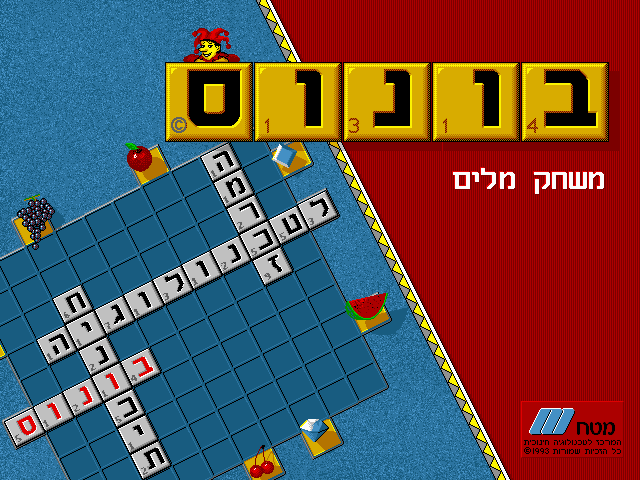

# Bonus Reverse Engineering Research

This repository is dedicated to my research into reverse-engineering the Israeli 1993 DOS game [Bonus](https://www.mobygames.com/game/dos/bonus).

The current objective of this research is to reverse and understand the core word engine used by the game, in an effort to preserve, replicate and enhance its dictionary. 

The core engine manages to encode a dictionary of nouns and verbs, including conjugations with respect to gender, plurality and tense.

I've been running these reversing efforts since 2019 or 2020, but included are only the most recent attempts.

**NOTE:** As the game is still being actively sold, this repo will not include any executable files, memory dumps or runtime logs.

## Knowledge Base

The information I've gathered so far from the reversing efforts, will be documented in a separate file: [knowledgebase.md](knowledgebase.md).

## Packages

### `gdb_dosbox`

An acquisition script used to record the memory and state of the game inside a [GDB-patched DosBox](https://www.vogons.org/viewtopic.php?t=30538) 
over a number of instructions and dump it into a binary file which can be viewed using the `timeline_viewer` package.

### `timeline_viewer`

A simple React application used to visualize the timeline acquired with the `gdb_dosbox` script in a view that can be scrubbed
forwards and backwards through time and inspect the memory and registers at every instruction.

## Previous Attempts

Disclaimer: The creator of this repository has no reverse-engineering experience and does not claim to have any experience 
or knowledge on the subject. Everything you are about to read is merely a log of my reversing attempts.

Initially, I attempted to statically analyze the game's executable using [Ghidra](https://github.com/NationalSecurityAgency/ghidra),
but found it to be difficult to make sense, due to the file being copy-protected and possible overlayed, or whatever other
techniques used by programmers on DOS in the early 1990s.

Later attempts including trying to use the [DosBox built-in debugger](https://www.vogons.org/viewtopic.php?t=3944) to both debug
and dump the game's memory at different times and states. 
Using the DosBox debugger made it difficult to follow the amounts of data and memory changes made by the game, as well as viewing the [Hebrew OEM 862 encoding](https://en.wikipedia.org/wiki/Code_page_862).

Using that last method required sitting down with pen and paper, painstakingly following instructions without seeing the big picture, 
testing my patience and attention span.

Even later attempts included trying to cross-check logs dumped from Ghidra and DosBox to discover hot-paths and functions, to partial success.

The last and current attempts incorporate trying to get a timeline dump of the game's memory and tracking the CPU instructions 
in attempt to create a viewer that will allow making sense of the big picture, as well as following individual instructions in parallel with Ghidra.
First, an attempt was made to do this with [QEMU](https://www.qemu.org/) and its built-in GDB server, running the game in [FreeDOS](https://www.freedos.org/).

Finally, the last attempt, as mentioned above, is performing the same process on a patched version of DosBox containing its own GDB server.